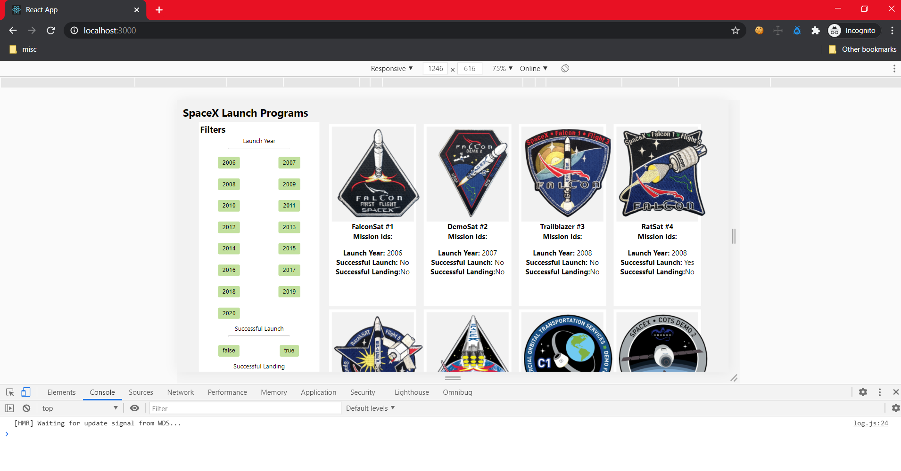

# Development Documentation

After the basic setup of a react js application, I have done the following implementations to complete the given tasks.

1.  Implemented hooks with functional components to render and re-render the page with the data.
2.  Filters are applied and passed to the Data component which renders the launch related info.
3.  Using event.target and hooks the filter toogle related functionality is implemented.
4.  Used a 'Id' property to control the re-rendering. So everytime a button is clicked the Id will be updated and passed onto the child component which is Data component. useEffect will call the method which handles the API based on updated Id.
5.  Created a simple row-column layout with mobile first approach to give responsiveness to the page.
6.  Also handled API error scenario and empty data scenario as well.
7.  Setup the application in Heroku and integrated with the github repository.

# Responsiveness
Mobile view - max width 700px

Tab view - max width 1024px

Desktop view - max width 1440px

Large view - beyond 1440px

# Lighthouse performance score

